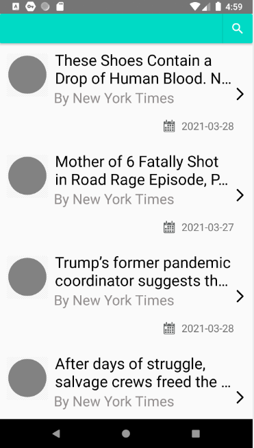
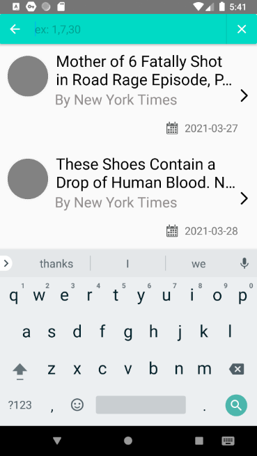
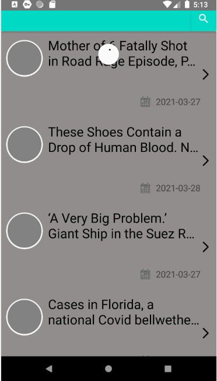
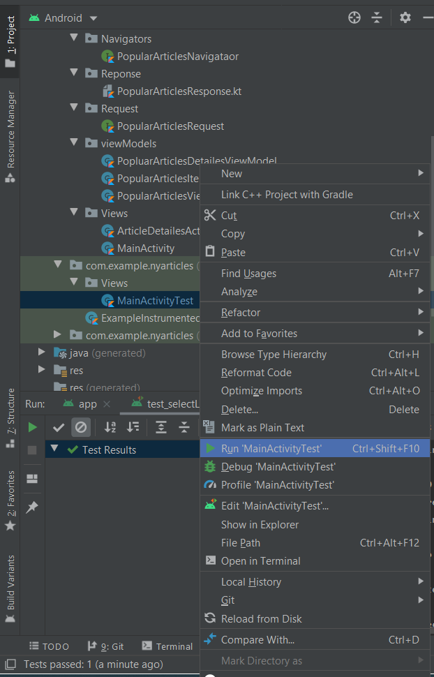

# About This Project
This project brings articles life data from "The New Your Times" news paper and their detailes, also the project has search function that the articles could be searched for a period of time.


# Project Screen Shots
<span align="center"></span>
<span align="center"></span>
<span align="center"></span>
<span align="center"></span>

# build and test

* Clone the [source repository](https://github.com/KiroAlbear/NY-Times-Most-PopularArticles.git) from Github. 
    * On the command line, enter:
    ````
    git clone https://github.com/KiroAlbear/NY-Times-Most-PopularArticles.git
    ````
* Open Android Studio >> c open an existing Project >> choose project folder.
* to test functionality of the project navigate to "MainActivityTest" File.
* <span align="center"></span>


